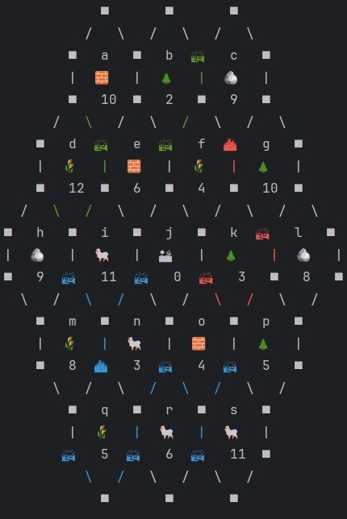
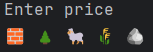
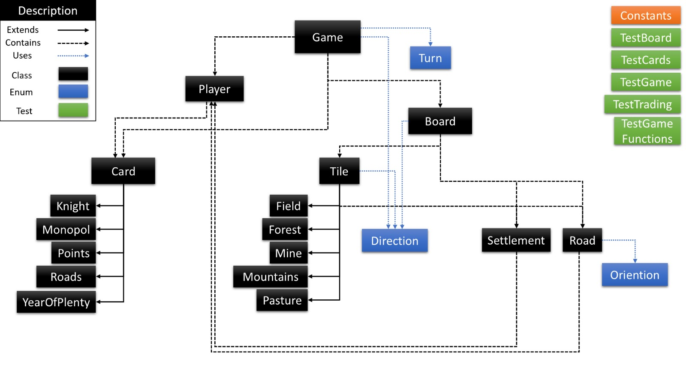
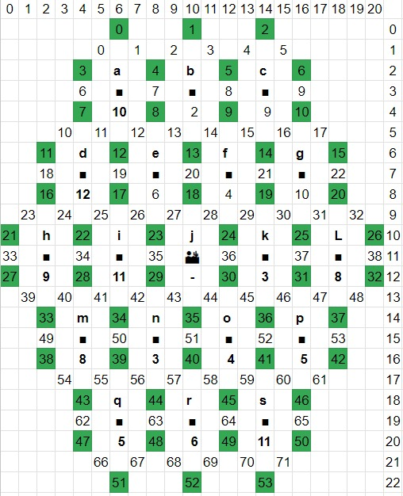

326627635 | adi.peisach@gmail.com
# CATAN - Systems Programming Assignment 3

In this assignment I built a Catan game.
The game can be played by 2-4 players and it follows most of the rules of Catan with a few exceptions.
The game is played in the console with a text and emoji based interface and it can take inputs through the console or through a text file.

## How to play
The default amount of players is 3, and their names are set in Demo.cpp.
In order to change it, change the players vector.
Run one of the following commands in the terminal:

    make
    make catan
The players will be prompted to place their initial settlements and roads.
Each tile has a unique letter to identify it. In order to choose a location to place a settlement, type the letter of
the tile you want to place it on and the direction of the location relative to the tile. For example:

    a southeast
After all players have placed their initial settlements and roads, the game will start.
At each turn you will be able to see the board, your resources, the dice roll and the available actions.
Type the name of the action in order to play it.
Sometimes you will be prompted with an enter price prompt:

In order to enter a price, you will have to choose how much of each resource you want to give. For example, if you want
1 brick and 2 wheat, type:

    1 0 0 2 0

Other than that, the instructions are pretty clear in the game:

At each turn, you will roll a dice and the board will produce resources (and if 7 was rolled every player with 7 or more resources will have to
lose half of his resources). After that, you can place settlements and roads, upgrade to cities, buy or play cards, trade with other players
as many times as you want until you end your turn by typing `end`.

## Project structure

The project follows OOP principles and is divided where each class has a single responsibility and is encapsulated to
have minimal API.

### Game

The game class is the main class of the project. It contains the board, the players and it handles the game logic and 
the game flow. The game can be started by initializing a game object and calling the `start()` method.

When initializing a game object, you can choose if you want a random game or the default seed and if you want to take
inputs from a file.

The game class is responsible for receiving inputs from the players and invoking the correct actions, while checking if
they are legal and handling payments.

### Player

The player class represents a player in the game. It contains the player's resources, development cards, knights and
points and it manages the player's inventory.

### Board

The board class represents the game board. It contains an 1-D array of tiles, and also saves an array of pointer to the
settlements and roads on the board (these are never accessed from their arrays, but from their tile. The array exist
in order to keep track of where the memory was allocated). In order for the tiles to hold the correct settlements and
roads, I gave each possible location on the board an ID:

The board class contains methods to generate a random board, to place and upgrade settlements and roads, to produce
resources and to check if a settlement or road can be placed. It also has a `toString()` method that returns a string
of the board as seen above.

### Tile

The tile class represents a tile on the board. It contains the tile's type, number, location and the settlements and
roads around it. The tile class contains methods to produce resources and to place a settlement or road on it.

The dessert tile is represented by a regular Tile object, while the other tiles are represented by one of the following:

- `Field` - a tile that produces wheat
- `Forest` - a tile that produces wood
- `Mine` - a tile that produces brick
- `Mountains` - a tile that produces stone
- `Pasture` - a tile that produces wool

### Settlement

The settlement class represents a settlement on the board. It contains the settlement's level: 0 for a vacant spot, 
1 for a settlement and 2 for a city. It also contains the player that owns the settlement.

### Road

The road class represents a road on the board. It contains the player that owns the road and a boolean that indicates
weather the road is built or not.

### Card

The card interface represents a card in the game. It contains the card's name and a method to use the card. There are
5 types of cards:

- `Knight` - after playing this card, the player receives a knight and a player with 3 knights receives the largest army
- `Roads` - after playing this card, the player can build 2 roads
- `Monopol` - after playing this card, the player can take all of a specific resource from all other players
- `YearOfPlenty` - after playing this card, the player can take 2 resources of his choice
- `Points` - after playing this card, the player receives a victory point

### Direction

The direction enum represents the 8 cardinal directions. It is used to determine the location of a settlement or road
relative to a tile. The namespace `Directions` contains a multiple helper functions to add and subtract directions and
get opposite directions.

## Tests

The project contains multiple tests that test the game logic and the game flow. There are test for specific units:
- `TestBoard` - tests the board methods
- `TestCards` - tests using the cards
- `TestGameFunctions` - tests the game logic
- `TestTrading` - tests the trading logic

These tests are run when calling `make test` through `TestCounter.cpp` that shows how many test passed and failed.
All of these tests use txt files to simulate the input and output of the game from the directory `TestInputs`.

In addition, `TestGame` is a test that runs a full game and checks if the game ends correctly. You can run it by calling
`make testfull`.

## Libraries used

Other than the standard libraries (string, iostream, vector...), I've also used unqie_ptr (also from the standard library)
in order to manage memory easily.
